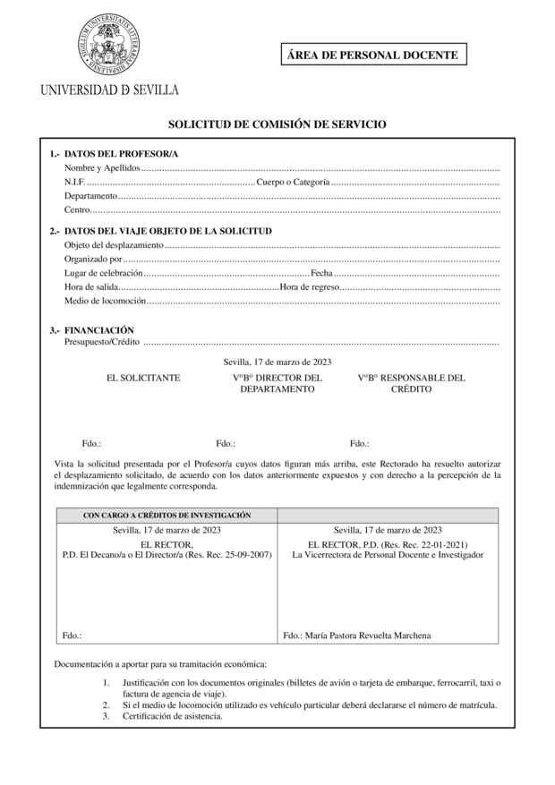

# Comisión de servicios Universidad de Sevilla

Plantilla LaTeX para las comisiones de servicio de la Universidad de Sevilla, basada en el modelo oficial del 27-1-2021.

Puedes bajar directamente la carpeta [`tex`](tex/), rellenar los datos necesarios en el archivo `cs.tex` y compilarlo con `pdflatex`. 

También se incluye (TO-DO) una utilidad de línea de comandos que permite obtener la comisión de servicio en PDF aportando simplemente los datos necesarios.

