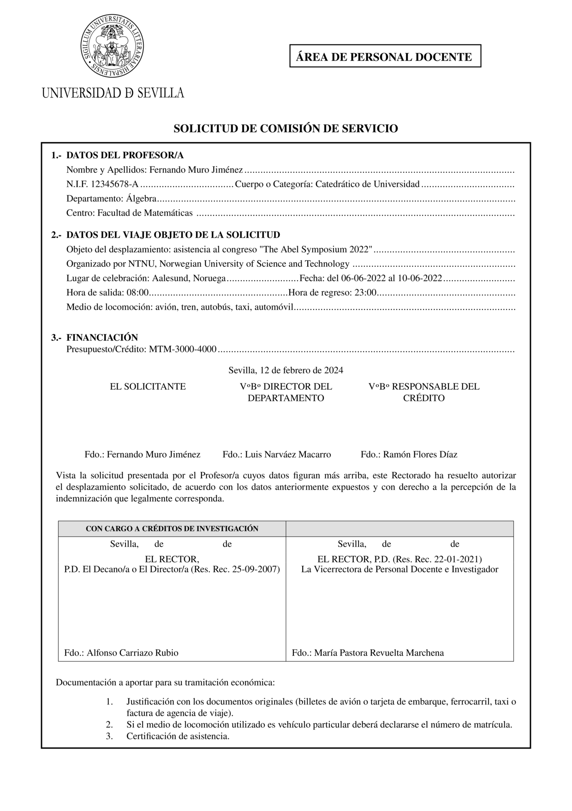

# Comisión de servicios de la Universidad de Sevilla

Es un script de python, ejecutable desde la línea de comandos, que produce una solicitud de comisión de servicios y licencia de la Universidad de Sevilla en PDF a partir de los datos básicos. La plantilla actual está basada en el modelo oficial del 27-1-2021.

Si lo prefieres, puedes simplemente copiar [`csdatos_cservicios.tex`](tests/csdatos_cservicios.tex), descargar [`logo.pdf`](csus/logo.pdf), modificar el fichero TeX con tus datos y la ruta correcta al logotipo y compilarlo sin instalar el script, y lo mismo con [`csdatos_licencia.tex`](tests/csdatos_licencia.tex).

# Instalación

Ejecuta el siguiente comando en tu terminal:

```
pip install --upgrade git+https://github.com/FMuro/comisiondeservicios.git#egg=csus
```

Este comando también sirve para actualizar a la versión más reciente.

# Instrucciones de uso

Necesitas crear un fichero de texto plano con los datos de la comisión de servicio. Ejecutando

```
cservicios -i
```

se crea el fichero `csdatos.yaml` en tu directorio actual y se abre con el editor de texto predeterminado del sistema. Edítalo con tus datos. 

Puedes cambiar el nombre `csdatos` por cualquier otro ejecutando 

```
cservicios -i nombre_que_elijas
```
Las siguientes instrucciones las tendrás que adaptar al nombre escogido. En sucesivos usos puedes crear el fichero `.yaml` desde cero o copiar uno anterior.

Para generar la solicitud de comisión de servicio en PDF tienes que ejecutar el script del siguiente modo:

```
cservicios -f csdatos.yaml
```

Esto generará dos fircheros PDF: `csdatos_cservicios.pdf` y `csdatos_licencia.pdf`.

Puedes cambiar el contenido por defecto del fichero `csdatos.yaml` para introducir tus datos personales y más frecuentes:

```
cservicios -c
```

Si el resultado no fuera el deseado, puedes obtener los archivos TeX en lugar de un PDF ejecutando:

```
cservicios -t -f csdatos.yaml
```

Esto generará archivos TeX con los mismo nombres que antes indicamos, por ejemplo `csdatos_cservicios.tex` y `csdatos_licencia.tex`. Puedes editar estos archivos para intentar obtener un mejor resultado. 

Si quieres compilar los ficheros TeX en un ordenador donde este script no esté instalado, tendrás que copiar el logotipo. La ruta aparece dentro los propios fichero TeX.

Puedes obtener ayuda en todo momento ejecutando el comando siguiente:

```
cservicios -h
```

# Desinstalación

```
pip uninstall csus
```

# Fuentes

[Pulsa aquí para acceder a los formularios oficiales de la Universidad de Sevilla.](https://www.us.es/trabaja-en-la-us/profesorado/gestion-administrativa/permisos-y-licencias)

